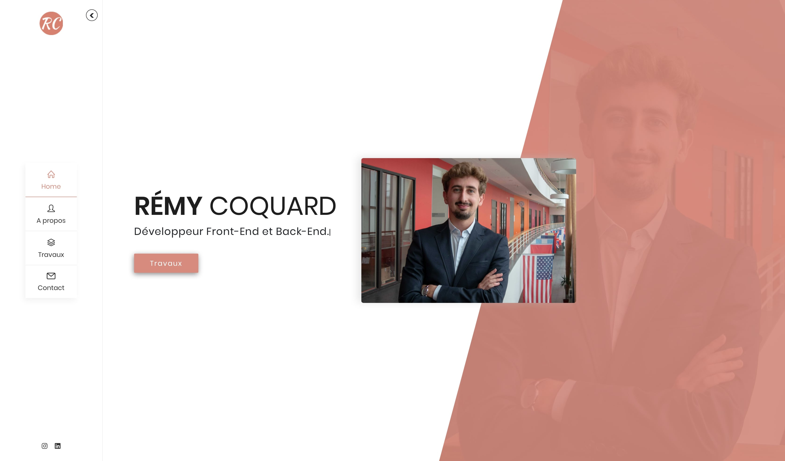

[](https://github.com/RemyCo/Site_perso/releases)
[](https://github.com/RemyCo/Site_perso/commits/master)
[](https://github.com/RemyCo/Site_perso/blob/master/LICENSE)



# Personnal site

My personnal site to present my projects and my work.

### Installation

```bash
# Clone this repository
$ git clone https://github.com/RemyCo/Site_perso.git
```

## Features

* About me
* Experiences
* Formation
* Skills
* Hobbies
* Work & Projects
* Contact

## Built With

* [Reva](https://themeforest.net/item/reva-personal-one-page-template/21518903) - The template inspired of 


## License

This project is licensed under the MIT License - see the [LICENSE.md](License.md) file for details
